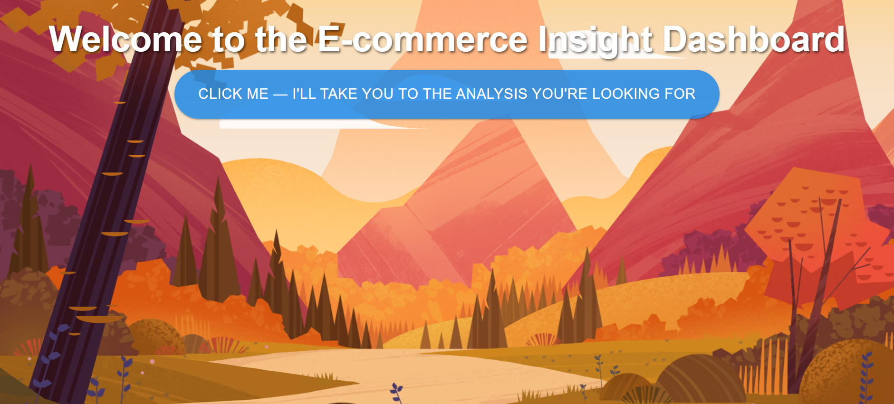
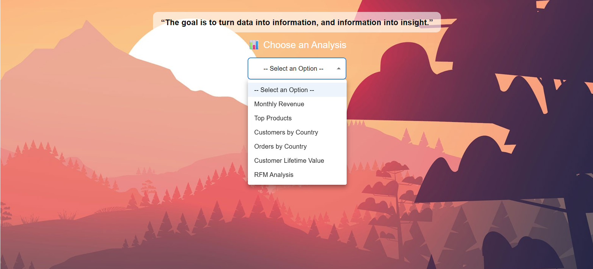

**Complete Guide to Deploying Your React + FastAPI App on Render and Pushing Code to GitHub**

---

## ✨ Project Journey: From Notebook to Full Web App

This project originally began as a simple **data analysis notebook** in Jupyter. The goal was to perform basic cleaning and gain insights from an E-commerce dataset. Over time, I realized that while the analysis was powerful, it wasn’t accessible or interactive. That's when I decided to turn this into a **full-stack web application**.

Here’s what I did to transform this into a production-ready web app:

* 🔍 **Started with Jupyter**: Performed data cleaning, aggregation, and visual exploration using pandas and matplotlib.
* 🧠 **Modularized logic**: Extracted all backend logic into Python functions inside `analysis_engine.py`.
* ⚙️ **Built a FastAPI backend**: Created endpoints for each analysis to serve clean data to the frontend.
* 🎨 **Created a React frontend**: Designed a beautiful, interactive UI with dropdown-based chart selection.
* 📦 **Connected frontend and backend**: API requests from React trigger backend computation dynamically.
* ☁️ **Deployed on Render**: Setup full deployment with `.render/build.sh`, hosted the frontend and backend together.

This transition from data exploration to a deployable web app has helped me deeply understand both data and software engineering pipelines.

---

## 📖 Project Overview

This is a full-stack **E-Commerce Insight Dashboard** built using **React** for the frontend and **FastAPI** for the backend. It visualizes and analyzes online retail data to help businesses understand key metrics such as:

* 📊 Monthly Revenue Trends
* 🔝 Top-Selling Products
* 🌍 Customers and Orders by Country
* 💷 Customer Lifetime Value (CLV)
* 🧠 RFM Analysis (Recency, Frequency, Monetary)

### 🔗 Live Demo

Visit the hosted dashboard: [E-Commerce Dashboard on Render](https://e-commerce-dashboard-8wvq.onrender.com/)

---

## 🚀 Features

* Interactive dropdown menu to select different analyses
* Beautiful background transitions for a seamless experience
* Clean, responsive visualizations using Plotly
* Business insights written below each chart for interpretation
* Smooth integration of frontend and backend using FastAPI

---

## 📁 Project Structure

```
E-CommerceAnalysis/
├── backend/
│   ├── main.py               # FastAPI app with routes
│   ├── analysis_engine.py    # Logic for each analysis
│   ├── requirements.txt      # Python dependencies
│
├── frontend-react/
│   ├── public/
│   ├── src/
│   ├── package.json          # React dependencies
│
└── .render/
    └── build.sh              # Deployment script
```

---

## 🛠️ How It Works

1. **Frontend** sends API request based on dropdown selection
2. **Backend** receives the request and runs logic from `analysis_engine.py`
3. **Response** is sent back to the React app and visualized using Plotly
4. Each chart is accompanied by tailored **business insights**

---

## 💡 Tech Stack

* **Frontend**: React + Material UI + Plotly.js
* **Backend**: FastAPI + Pandas + Uvicorn
* **Deployment**: Render (with `.render/build.sh` for multi-part deployment)

---

## 🖼️ Screenshots

> Upload screenshots in the GitHub `README` section as follows:





---

## 📦 Installation (Locally)

```bash
git clone https://github.com/vandank/E-Commerce-Dashboard.git
cd E-Commerce-Dashboard

# Frontend
cd frontend-react
npm install
npm start

# Backend
cd ../backend
pip install -r requirements.txt
uvicorn main:app --reload
```

---

## 📤 Deployment (Render)

* Create `.render/build.sh` and add this:

```bash
#!/usr/bin/env bash
cd frontend-react
npm install
npm run build
cd ../backend
pip install -r requirements.txt
```

* Set build command to `.render/build.sh`
* Start command: `uvicorn backend.main:app --host 0.0.0.0 --port 10000`
* Add environment variable: `PORT = 10000`

---

## 🙌 Acknowledgments

* [Kaggle Online Retail Dataset](https://www.kaggle.com/datasets) for data inspiration
* [Render](https://render.com/) for deployment
* [Plotly](https://plotly.com/) and [FastAPI](https://fastapi.tiangolo.com/) for tooling

---

## 📬 Contact

Feel free to reach out via GitHub issues or connect with me on [GitHub](https://github.com/vandank)

**Give the repo a ⭐ if you like it!** 😄
